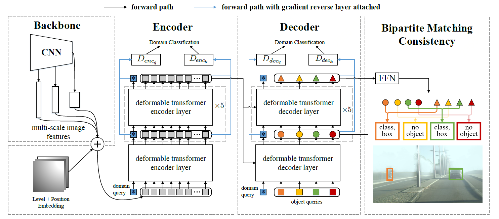

# Sequence Feature Alignment (SFA)

By Wen Wang,  Yang Cao,  Jing Zhang, Fengxiang He, Zheng-jun Zha, Yonggang Wen, and Dacheng Tao

This repository is an official implementation of the paper [Exploring Sequence Feature Alignment for Domain Adaptive Detection Transformers](https://arxiv.org/abs/2107.12636), which is accepted to ACM MultiMedia 2021.


## Introduction

**TL; DR.**  We develop a domain adaptive object detection method **SFA** that is specialized for adaptive detection transformers. It contains a domain query-based feature alignment model and a token-wise feature alignment module for global and local feature alignment respectively, and a bipartite matching consistency loss for improving robustness. 



**Abstract.**  Detection transformers have recently shown promising object detection results and attracted increasing attention. However, how to develop effective domain adaptation techniques to improve its cross-domain performance remains unexplored and unclear. In this paper, we delve into this topic and empirically find that direct feature distribution alignment on the CNN backbone only brings limited improvements, as it does not guarantee domain-invariant sequence features in the transformer for prediction. To address this issue, we propose a novel Sequence Feature Alignment (SFA) method that is specially designed for the adaptation of detection transformers. Technically, SFA consists of a domain query-based feature alignment (DQFA) module and a token-wise feature alignment (TDA) module. In DQFA, a novel domain query is used to aggregate and align global context from the token sequence of both domains. DQFA reduces the domain discrepancy in global feature representations and object relations when deploying in the transformer encoder and decoder, respectively. Meanwhile, TDA aligns token features in the sequence from both domains, which reduces the domain gaps in local and instance-level feature representations in the transformer encoder and decoder, respectively. Besides, a novel bipartite matching consistency loss is proposed to enhance the feature discriminability for robust object detection. Experiments on three challenging benchmarks show that SFA outperforms state-of-the-art domain adaptive object detection methods.

## Main Results

The experimental results and model weights for Cityscapes to Foggy Cityscapes are shown below.

|       Model       | mAP  | mAP@50 | mAP@75 | mAP@S | mAP@M | mAP@L | Log & Model |
| :----------------: | :------: | :------: | :------: | :------: | :------: | :------: | :------: |
| SFA-DefDETR | 21.5 |  41.1  |  20.0  |  3.9  | 20.9  | 43.0  | [Google Drive](https://drive.google.com/drive/folders/1onPNgNaJkKKfYCizisZKmm1-xGZ9hLeB?usp=sharing) |
| SFA-DefDETR-BoxRefine | 23.9 | 42.6 | 22.5 | 3.8 | 21.6 | 46.7 | [Google Drive](https://drive.google.com/drive/folders/1CHAj09z1hkDSZ2X_4U28I-RLlA03lBqV?usp=sharing) |
| SFA-DefDETR-TwoStage | 24.1 | 42.5 | 22.8 | 3.8 | 22.0 | 48.1 | [Google Drive](https://drive.google.com/drive/folders/1eODtm93v21V523rGvnoHX8kDhz375Fqr?usp=sharing) |

*Note:*

1. All models of SFA are trained with total batch size of 4. 
2. "DefDETR" means Deformable DETR (with R50 backbone). 
3. "BoxRefine" means Deformable DETR with iterative box refinement.
4. "TwoStage" indicates the two-stage Deformable DETR variant.
5. The original implementation is based on our internal codebase. There are slight differences in the released code are slight differences. For example, we only use the middle features output by the first encoder and decoder layers for hierarchical feature alignment, to reduce computational costs during training. 


## Installation

### Requirements

* Linux, CUDA>=9.2, GCC>=5.4
  
* Python>=3.7

    We recommend you to use Anaconda to create a conda environment:
    ```bash
    conda create -n sfa python=3.7 pip
    ```
    Then, activate the environment:
    ```bash
    conda activate sfa
    ```
  
* PyTorch>=1.5.1, torchvision>=0.6.1 (following instructions [here](https://pytorch.org/))

    For example, if your CUDA version is 9.2, you could install pytorch and torchvision as following:
    ```bash
    conda install pytorch=1.5.1 torchvision=0.6.1 cudatoolkit=9.2 -c pytorch
    ```
  
* Other requirements
    ```bash
    pip install -r requirements/requirements.txt
    ```

* Logging using [wandb](https://wandb.ai/site) (optional)
    ```bash
    pip install -r requirements/optional.txt
    ```

### Compiling CUDA operators
```bash
cd ./models/ops
sh ./make.sh
# unit test (should see all checking is True)
python test.py
```

## Usage

### Dataset preparation

We use the preparation of Cityscapes to Foggy Cityscapes adaptation as demonstration. Other domain adaptation benchmarks can be prepared in analog.
Cityscapes and Foggy Cityscapes datasets can be downloaded from [here](https://www.cityscapes-dataset.com/login/). The annotations in COCO format can be obtained from [here](https://drive.google.com/drive/folders/1x95Qjun_AIi6BvtqGwWF6y9kPrVFIcI9?usp=sharing). Afterward, please organize the datasets and annotations as following:

```
[coco_path]
└─ cityscapes
   └─ leftImg8bit
      └─ train
      └─ val
└─ foggy_cityscapes
   └─ leftImg8bit_foggy
      └─ train
      └─ val
└─ CocoFormatAnnos
   └─ cityscapes_train_cocostyle.json
   └─ cityscapes_foggy_train_cocostyle.json
   └─ cityscapes_foggy_val_cocostyle.json
```

### Training

As an example, we provide commands for training our SFA on a single node with 4 GPUs for weather adaptation.

#### Training SFA-DeformableDETR

```bash
GPUS_PER_NODE=4 ./tools/run_dist_launch.sh 4 ./configs_da/sfa_r50_deformable_detr.sh --wandb
```

#### Training SFA-DeformableDETR-BoxRefine

```bash
GPUS_PER_NODE=4 ./tools/run_dist_launch.sh 4 ./configs_da/sfa_r50_deformable_detr_plus_iterative_bbox_refinement.sh --wandb
```

#### Training SFA-DeformableDETR-TwoStage

```bash
GPUS_PER_NODE=4 ./tools/run_dist_launch.sh 4 ./configs_da/sfa_r50_deformable_detr_plus_iterative_bbox_refinement_plus_plus_two_stage.sh --wandb
```

#### Training Source-only DeformableDETR
Please refer to the ```source``` branch.

### Evaluation

You can get the config file and pretrained model of SFA (the link is in "Main Results" session), then run following command to evaluate it on Foggy Cityscapes validation set:

```bash
<path to config file> --resume <path to pre-trained model> --eval
```

You can also run distributed evaluation by using ```./tools/run_dist_launch.sh``` or ```./tools/run_dist_slurm.sh```.

## Acknowledgement 

This project is based on [DETR](https://github.com/facebookresearch/detr) and  [Deformable DETR](https://github.com/fundamentalvision/Deformable-DETR). Thanks for their wonderful works. See [LICENSE](./LICENSE) for more details. 


## Citing SFA
If you find SFA useful in your research, please consider citing:
```bibtex
@inproceedings{wang2021exploring ,
  title={Exploring Sequence Feature Alignment for Domain Adaptive Detection Transformers},
  author={Wen, Wang and Yang, Cao and Jing, Zhang and Fengxiang, He and Zheng-Jun, Zha and Yonggang, Wen and Dacheng, Tao},
  booktitle={Proceedings of the 29th ACM International Conference on Multimedia},
  year={2021}
}
```
